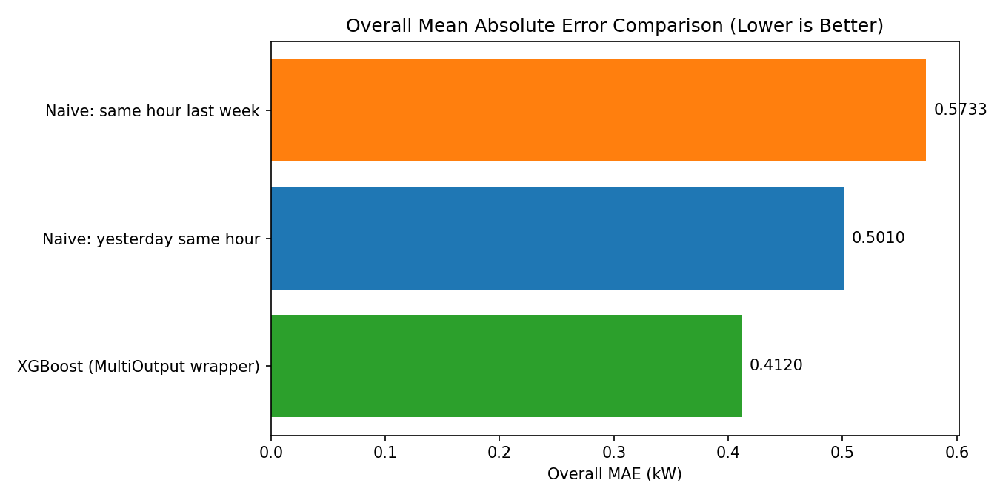
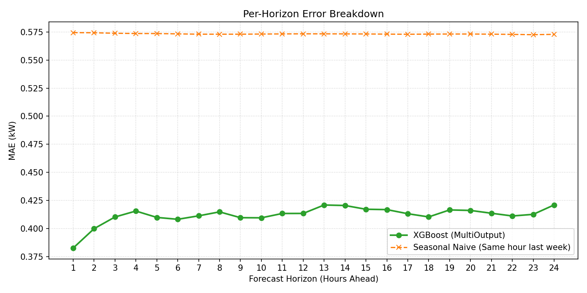
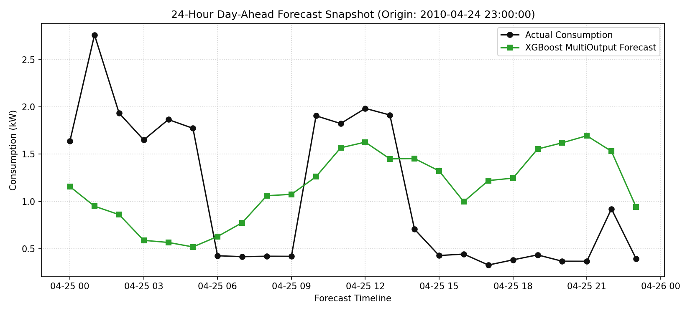
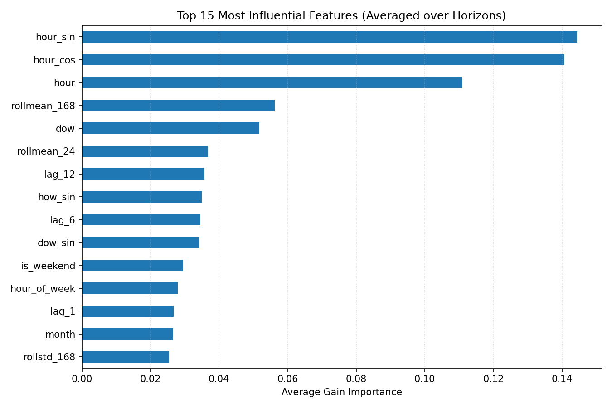

# ⚡ Day-Ahead Electricity Load Forecasting using XGBoost

## Overview

This project implements a **Day-Ahead Electricity Load Forecaster** for a **single smart meter** using the **UCI Individual Household Electric Power Consumption Dataset**.

The objective is to forecast the **next 24 hours of electricity consumption** using historical hourly energy consumption while strictly preventing **data leakage** through chronological train-test splitting.

The forecasting model is built using **XGBoost** wrapped inside **MultiOutputRegressor**, allowing the model to independently predict each of the next **24 forecast horizons**. The model is evaluated against two naïve forecasting baselines and visualized using multiple performance plots.

---

# Dataset

**Dataset**

UCI Individual Household Electric Power Consumption Dataset

- Minute-level electricity consumption
- One residential household
- Approximately 4 years of observations
- Missing values represented using `?`

The dataset contains the following measurements:

- Global Active Power
- Global Reactive Power
- Voltage
- Global Intensity
- Sub Metering 1
- Sub Metering 2
- Sub Metering 3

Only **Global Active Power** is used for forecasting household electricity demand.

---
In addition to model development, this project demonstrates an end-to-end **MLOps workflow** including:

- MLflow for experiment tracking
- DVC for dataset versioning
- Joblib for model serialization
- FastAPI for model serving
- GitHub Actions for continuous integration (CI)

The pipeline is designed to be reproducible, modular, and suitable for production-oriented machine learning workflows.

# Project Structure

```
electricity-load-forecaster/
│
├── main.py
├── api.py
├── predict.py
├── requirements.txt
├── README.md
├── .gitignore
│
├── .github/
│   └── workflows/
│       └── train.yml
│
├── mlruns/
├── models/
├── .dvc/
├── dvc.yaml
│
├── overall_mae_comparison.png
├── feature_importance.png
├── per_horizon_mae.png
└── forecast_snapshot.png
```

---
## 2. Download the dataset

Download the dataset from:

https://drive.google.com/drive/folders/1G4ZwJn1WkehYNhYAG4KEyKY43Kpe5Y46?usp=sharing

Place the downloaded `household_power_consumption.txt` file in the project root directory.


# Methodology

The forecasting pipeline consists of the following stages.

---

## 1. Data Loading

The dataset can be loaded in three different ways:

- Local `household_power_consumption.txt`
- User-specified file path using

```bash
python main.py --data-path path/to/file.txt
```

- Automatically downloaded from the UCI Machine Learning Repository using `ucimlrepo`

During loading, the pipeline:

- Parses Date and Time columns
- Creates a DatetimeIndex
- Converts missing values (`?`) into NaN
- Converts Global Active Power into numeric values
- Sorts observations chronologically

---

## 2. Hourly Resampling

The original dataset contains minute-level power measurements.

These are converted into hourly energy consumption using

\[
Hourly\ Energy = \frac{\sum Minute\ Power}{60}
\]

This converts minute-level kW readings into hourly kWh consumption.

Missing hourly observations are handled using:

- Linear interpolation for short gaps
- Same-hour previous-week values
- Forward fill
- Backward fill

This produces a continuous hourly time series suitable for forecasting.

---

## 3. Feature Engineering

The forecasting model relies on historical consumption patterns rather than raw timestamps.

### Lag Features

Historical consumption values are included as predictors.

- Lag 1 hour
- Lag 2 hours
- Lag 3 hours
- Lag 6 hours
- Lag 12 hours
- Lag 24 hours
- Lag 48 hours
- Lag 72 hours
- Lag 168 hours

These features allow the model to capture short-term and weekly dependencies.

---

### Rolling Statistics

Rolling statistics summarize recent consumption behavior.

Features include:

- 24-hour rolling mean
- 168-hour rolling mean
- 24-hour rolling standard deviation
- 168-hour rolling standard deviation

Rolling windows are shifted before computation to prevent data leakage.

---

### Calendar Features

The following calendar variables are extracted:

- Hour
- Day of Week
- Month
- Weekend Indicator
- Holiday Indicator

Holiday information is generated using the **holidays** Python package.

---

### Hour-of-Week Encoding

To better capture recurring weekly consumption patterns, an additional structural feature is introduced.

Features include:

- Hour of Week
- Hour-of-Week Sine
- Hour-of-Week Cosine

These encode the interaction between hour and weekday.

---

### Cyclical Time Encoding

Time variables are transformed using sine and cosine encoding.

Features include

```
hour_sin
hour_cos
dow_sin
dow_cos
```

This preserves cyclical continuity.

For example,

23:00 and 00:00 remain numerically close.

---

## 4. Multi-Horizon Forecasting

Instead of recursively forecasting one hour at a time, the model directly predicts

- t + 1
- t + 2
- ...
- t + 24

Each forecasting horizon is modeled independently using **MultiOutputRegressor**, which trains one XGBoost model for every forecast horizon.

This avoids cumulative forecasting error.

---

## 5. Preventing Data Leakage

To simulate real-world forecasting,

the dataset is split **chronologically**.

```
Past -----------------------------> Future

Training             Testing
```

Feature engineering uses only historical observations.

No future information is used during model training.

---

## 6. Machine Learning Model

Model Used

**XGBoost Regressor**

Each forecast horizon is learned independently using

```python
MultiOutputRegressor(
    XGBRegressor(
        n_estimators=150,
        max_depth=6,
        learning_rate=0.05,
        subsample=0.8,
        colsample_bytree=0.8,
        random_state=0
    )
)
```

Advantages of this approach include

- Strong nonlinear learning capability
- High predictive accuracy
- Robustness to outliers
- Independent optimization for each forecast horizon
- Efficient handling of engineered tabular features

---

# Baseline Models

Two naïve forecasting baselines are implemented.

## Baseline 1

Tomorrow looks like today

Forecast

```
Prediction(t+h) = Actual(t+h−24)
```

---

## Baseline 2

Same hour last week

Forecast

```
Prediction(t+h) = Actual(t+h−168)
```

---

# Evaluation Metrics

Model performance is evaluated using

- Mean Absolute Error (MAE)
- Root Mean Squared Error (RMSE)

Metrics are computed over the complete held-out chronological test period.

Additionally,

Per-horizon MAE is computed for each forecast horizon from

- 1 hour ahead
- 24 hours ahead

---

# Results

The proposed **XGBoost MultiOutput** forecasting model significantly outperforms both naïve forecasting baselines on the held-out chronological test set.

| Method | MAE (kW) | RMSE (kW) |
|:----------------------------------|---------:|----------:|
| **XGBoost (MultiOutput Wrapper)** | **0.4120** | **0.5681** |
| Naïve: Yesterday Same Hour | 0.5010 | 0.7535 |
| Naïve: Same Hour Last Week | 0.5733 | 0.8230 |

The proposed model achieves:

- **17.8% lower MAE** than the **Yesterday Same Hour** (persistence) baseline.
- **28.1% lower MAE** than the **Same Hour Last Week** (seasonal naïve) baseline.
- The lowest RMSE among all evaluated methods, demonstrating better overall predictive accuracy and robustness across the 24-hour forecasting horizon.

These results indicate that the engineered lag features, rolling statistics, calendar information, and XGBoost's nonlinear learning capability substantially improve day-ahead household electricity load forecasting compared to simple persistence-based approaches.


## Overall Model Comparison

Compares overall MAE of all forecasting methods.



---

## Per-Horizon Forecast Error

Shows forecasting error from Hour 1 to Hour 24, demonstrating how prediction difficulty increases with forecasting horizon.



---

## Forecast Snapshot

Visual comparison between:

- Actual household electricity consumption
- Predicted 24-hour consumption

for one forecasting origin.



---

## Feature Importance

Feature importance is computed by averaging the importance values across all 24 XGBoost models.

Important predictors include:

- Lag 24
- Lag 168
- Rolling Mean (168)
- Rolling Mean (24)
- Hour
- Hour-of-Week
- Hour Cosine
- Hour Sine
- Weekend Indicator
- Holiday Indicator



---
# Performance Highlights

- Direct 24-hour forecasting
- MultiOutput XGBoost architecture
- Chronological train-test split
- Leakage-free feature engineering
- Rich lag and rolling statistics
- Cyclical calendar encoding
- Hour-of-week structural encoding
- Holiday-aware forecasting
- Automatic UCI dataset loading
- Feature importance visualization
- Multiple evaluation plots
- Comparison against persistence and seasonal naïve baselines

---

# Time Complexity

Let

- N = Number of hourly observations
- T = Number of boosting trees
- H = Forecast horizons (24)

## Feature Engineering

```
O(N)
```

---

## Training

```
O(H × T × N log N)
```

since one XGBoost model is trained for each forecast horizon.

---

## Prediction

```
O(H × T)
```

---
# MLOps Workflow

This project incorporates several MLOps practices to improve reproducibility, experiment management, and deployment readiness.
- MLflow experiment tracking
- DVC dataset versioning
- Joblib model serialization
- FastAPI inference API
- GitHub Actions CI workflow
- Reproducible machine learning pipeline
## Experiment Tracking

- MLflow is used to log:
  - Hyperparameters
  - Evaluation metrics (MAE and RMSE)
  - Generated evaluation plots
  - Training runs

## Data Versioning

- DVC is used to version the electricity consumption dataset without storing the dataset directly in GitHub.

## Model Serialization

- The trained XGBoost model is saved using Joblib for reuse during inference.

## Model Serving

- A FastAPI application exposes the trained model through a REST API for prediction.

## Continuous Integration

- GitHub Actions automatically validates the project on every push by installing dependencies and running project checks.

# How to Run

Install dependencies

```bash
pip install -r requirements.txt
```

Run using automatic dataset download

```bash
python main.py
```

Run using local dataset

```bash
python main.py --data-path household_power_consumption.txt
```
## MLflow Experiment Tracking

Start the MLflow tracking UI:

```bash
mlflow ui
```

Open your browser and navigate to:

```
http://127.0.0.1:5000
```

The dashboard displays:

- Training runs
- Hyperparameters
- MAE and RMSE
- Generated evaluation plots

## Run Prediction API

Start the API server:

```bash
uvicorn api:app --reload
```

Open:

```
http://127.0.0.1:8000/docs
```

to access the interactive Swagger API documentation.
## Data Versioning

Initialize DVC:

```bash
dvc init
```

Track the dataset:

```bash
dvc add household_power_consumption.txt
```

Check dataset status:

```bash
dvc status
```

## Continuous Integration

GitHub Actions automatically performs project validation whenever changes are pushed to the repository.

The workflow includes:

- Installing project dependencies
- Verifying the codebase
- Ensuring reproducibility
    

---


# Libraries Used

### Machine Learning
- Python
- NumPy
- Pandas
- Scikit-Learn
- XGBoost
- Holidays

### Visualization
- Matplotlib

### MLOps
- MLflow (Experiment Tracking)
- DVC (Data Versioning)
- Joblib (Model Serialization)
- FastAPI (Model Serving)
- Uvicorn (ASGI Server)

### Development & CI
- Git
- GitHub Actions

---

# Assignment Questions

## 1. What would you change if you had to forecast hundreds of thousands of smart meters?

Forecasting hundreds of thousands of smart meters requires a scalable architecture rather than individual models.

Recommended improvements include

- Apache Spark or Dask for distributed processing
- Cloud storage such as Amazon S3 or Snowflake
- Global forecasting models shared across many smart meters
- Additional metadata including customer type and location
- Automated retraining using Apache Airflow
- Containerized deployment using Docker and Kubernetes
- Distributed inference for real-time prediction

---

## 2. Do utilities actually use models like this?

Yes.

Electric utility companies increasingly rely on machine learning for

- Demand forecasting
- Grid balancing
- Peak load estimation
- Renewable energy integration
- Energy trading
- Demand response programs

Gradient boosting models such as **XGBoost**, **LightGBM**, and **CatBoost** are widely adopted because they provide excellent predictive accuracy on structured tabular data while remaining computationally efficient.

Large utilities often combine machine learning with statistical forecasting and deep learning depending on the forecasting scale and operational requirements.

---

# Future Improvements

- LightGBM
- CatBoost
- Temporal Fusion Transformer (TFT)
- Informer
- N-HiTS
- Weather data integration
- Public holiday calendars
- Hyperparameter optimization using Optuna
- Time-series cross-validation
- FastAPI deployment
- Streamlit dashboard
- Online model retraining
## Future ops Improvements

- Docker containerization
- Kubernetes deployment
- Prometheus monitoring
- Grafana dashboards
- Evidently AI for data and model drift detection
- Automated retraining pipeline using Airflow
- Cloud deployment on AWS or Azure
- Model registry using MLflow

---
